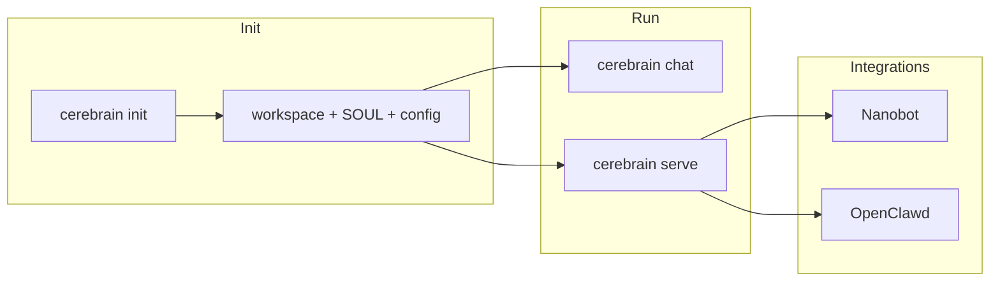
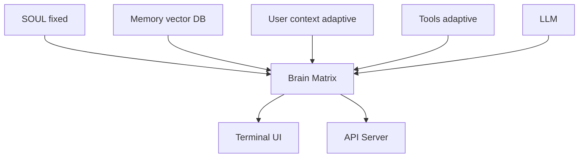

"Cerebrain" - Brain Matrix CLI - Project Proposal

## Project Overview

Cerebrain is a terminal-based, ASCII-visualized **brain matrix** — not a single
agent, but a system of brain parts (emotional, logical, memory, inspiration)
working together, extended from the agent concept. It simulates emotional,
logical, and memory processes with true inspiration generation. It's an
open-source framework for creating personalized AI personalities with continuous
learning and stateful processing.

### Scope

- **In scope (v1):** Single-brain matrix (multiple brain parts), terminal-first;
  SOUL + MEMORY + USER + TOOLS; ASCII visualization; init flow; one
  self-contained vector store; HTTP/WebSocket API for integration with other
  tools (e.g. Nanobot, OpenClawd); CLI only (no web UI).
- **Out of scope (v1):** Multi-brain communication, training mode, plugin
  system, web UI. These remain in Future extensions.

## Distribution & Install

Cerebra is installable on Linux and macOS via standard Python tooling.

- **PyPI:** `pip install cerebrain`
- **uv:** `uv tool install cerebrain` for isolated, fast install.
- **From source:**
  `git clone https://github.com/shuurai/cerebrain.git && cd cerebrain && pip install -e .`
  or `uv pip install -e .`

Platform support: Linux and macOS are explicitly supported. Windows is untested;
community contributions welcome.

## Initialize Before Use

Cerebra must be initialized before first use. No `chat` or `serve` until at
least one brain is created.

- **First-time:** Run `cerebrain init` (or `cerebrain onboard`). This creates
  workspace, config, and the first brain.
- **Base SOUL:** Stored at init (e.g. `~/.cerebrain/workspace/<brain>/SOUL.md`
  or inside `brain_states/`) — personality, values, communication style. SOUL is
  the fixed core and does not change automatically.
- **Adaptive over time:**
  - **User context:** e.g. `workspace/USER.md` or per-brain user file; updated
    as preferences/facts are learned. User Context is adaptive.
  - **Tools:** The set of tools and their descriptions can be extended or
    configured over time (e.g. via config or workspace `TOOLS.md`); tool-use
    results feed back into memory. Tools are adaptive in configuration and
    usage; SOUL does not change.

**Principle:** Base SOUL is set at init; Tools and User Context are adaptive
over time.





## Core Features

1. **Terminal-based Brain Visualization** — Real-time ASCII art showing brain
   activity. Default `cerebrain chat` runs the interactive terminal UI with
   ASCII visualization; use `cerebrain chat --no-visual` for terminal chat
   without ASCII.
2. Brain Matrix Architecture — emotional, logical, memory, and inspiration parts
   (extended from agent concept)
3. Natural Randomness — Quantum/atmospheric sources with fallbacks
4. LLM Agnostic — Plug in any LLM API (OpenAI, Anthropic, Ollama, etc.)
5. Persistent State — Saves brain state between sessions
6. Metrics Dashboard — Real-time monitoring of brain metrics

## Tech Stack

- Python 3.11+
- **Typer** (CLI), **Rich** (terminal UI, ASCII art, tables/panels)
- Textual (optional for advanced UI)
- **Self-contained vector database:** ChromaDB in persistent local mode (single
  directory, no separate server process), or alternatively sqlite-vec. One
  vector store per brain under `~/.cerebrain` (or project data dir); no
  distributed/external vector service in v1.
- Sentence-Transformers (embeddings)
- Requests (API calls)
- PyYAML (configuration)
- SQLite (state persistence)
- **pyproject.toml** as primary (entry point
  `cerebrain = "cerebrain.cli.commands:app"`, Hatchling build); optional
  `requirements.txt` for legacy pip.

## Project Structure

```
cerebrain/
├── core/
│   ├── __init__.py
│   ├── brain_agent.py      # Brain matrix orchestration
│   ├── emotional_self.py   # Mood, emotion dynamics
│   ├── logical_self.py     # LLM interface & reasoning
│   ├── memory_system.py    # Short/Long term memory
│   ├── inspiration_engine.py  # Randomness & creativity
│   └── consciousness.py   # Attention & integration
├── ui/
│   ├── terminal_brain.py   # ASCII brain visualization
│   ├── metrics_dashboard.py
│   └── chat_interface.py
├── api/                    # HTTP + WebSocket server (Integration API)
│   ├── __init__.py
│   ├── server.py
│   └── routes.py
├── data/
│   ├── brain_states/
│   ├── memory_vectors/     # Vector DB storage (self-contained)
│   └── logs/
├── utils/
│   ├── randomness.py
│   ├── config_loader.py
│   ├── api_clients.py
│   └── persistence.py
├── config/
│   ├── default_brain.yaml
│   ├── llm_providers.yaml
│   └── emotion_profiles.yaml
├── scripts/
│   ├── setup_cerebraai.py  # Init / brain creation
│   └── brain_diagnostics.py
├── cli/
│   ├── __init__.py
│   └── commands.py         # Typer app
├── pyproject.toml
├── README.md
├── LICENSE (MIT)
└── cerebrain/__main__.py   # python -m cerebrain
```

## Implementation Phases (Tightened)

- **Phase 1 — Foundation:** Core architecture, Typer CLI skeleton, configuration
  system, LLM API adapter interface, basic persistence layer.
- **Phase 2 — Brain & Memory:** Emotional Self, natural randomness sources,
  memory system with self-contained vector DB, inspiration engine basics.
- **Phase 3 — Terminal UI:** ASCII brain visualization (Rich), multi-panel
  display, real-time metrics dashboard, interactive chat interface, color-coded
  activity indicators.
- **Phase 4 — Integration:** Full system integration, state persistence
  (save/load brain), HTTP/WebSocket API server, performance optimization, basic
  diagnostics, documentation.

## Status (Implementation Progress)

| Area                         | Status | Notes                                                                                                                                                                                                                                                                                            |
| ---------------------------- | ------ | ------------------------------------------------------------------------------------------------------------------------------------------------------------------------------------------------------------------------------------------------------------------------------------------------ |
| **Phase 1 — Foundation**     | Done   | CLI (Typer), config (YAML, ~/.cerebrain), persistence (brain_states, list/load/save/export), init wizard (SOUL, USER, TOOLS, LLM templates).                                                                                                                                                     |
| **Phase 2 — Brain & Memory** | Done   | EmotionalSelf (baseline + nudge), NaturalRandomness (ANU/random.org + SystemEntropy), MemorySystem (short-term + optional ChromaDB long-term), InspirationEngine (spark), LogicalSelf (OpenAI-compatible HTTP client). BrainAgent orchestrates all; system prompt from SOUL/USER/TOOLS + memory. |
| **Phase 3 — Terminal UI**    | Done   | ASCII brain frame, consciousness stream (mood/inspiration after reply), metrics dashboard (generate_metrics_panel). Chat loop with optional --no-visual.                                                                                                                                         |
| **Phase 4 — Integration**    | Done   | State persistence (save/load brain), HTTP API (cerebrain serve, default port 17971), POST /v1/chat uses BrainAgent.process_message. Diagnostics (cerebrain diagnose), export.                                                                                                                    |
| **LLM providers**            | Done   | OpenRouter (default), openai, anthropic, ollama, local. Model templates (minimax/minimax-m2 default for OpenRouter, max_tokens 8192, temperature 0.7). API key from config.                                                                                                                      |
| **WebSocket API**            | Done   | `WS /v1/stream`: one agent per connection, send JSON `{content}`, receive `{reply, session_id}`. Requires FastAPI/uvicorn (used when available).                                                                                                                                                 |
| **Optional ChromaDB**        | Done   | Long-term vector memory when `pip install cerebrain[chromadb]`; otherwise long-term is no-op.                                                                                                                                                                                                    |

**Current codebase:** Phase 1–4 and WebSocket implemented; CLI, chat, serve
(HTTP + WS), init, status, list, diagnose, export all functional.

## Integration API

Cerebra can run as a "brain service" so other tools (e.g. Nanobot, OpenClawd)
can call it via HTTP or WebSocket.

- **Server:** `cerebrain serve [--brain NAME] [--port PORT]` (default port
  17971).
- **HTTP API:** REST on a single port:
  - `POST /v1/chat` or `POST /v1/messages` — send message, return stream or
    final response. Body: JSON with `role`, `content`, optional `session_id`.
  - `GET /v1/status` or `GET /health` — health/readiness.
  - `GET /v1/brain` (optional) — current brain config (non-sensitive).
- **WebSocket:** `WS /v1/stream` — stateful chat: one brain matrix per
  connection. Send JSON `{"content": "..."}` (or `"message"`); receive
  `{"reply": "...", "session_id": "..."}`. On connect, server sends
  `{"type": "connected", "brain": "..."}`. Requires FastAPI/uvicorn (used when
  available).
- **Integrations:** Nanobot and OpenClawd can use HTTP or WebSocket clients to
  talk to cerebrain when it runs in server mode.

## CLI Reference

Entry point: `cerebrain` (and `python -m cerebrain`). Use Typer and Rich for
output (tables, panels).

| Command                                                  | Description                                                                               |
| -------------------------------------------------------- | ----------------------------------------------------------------------------------------- |
| `cerebrain init` (or `cerebrain onboard`)                | Initialize/create brain (required before first use)                                       |
| `cerebrain chat [--brain NAME] [--no-visual]`            | Interactive chat with ASCII visualization (default); `--no-visual` for terminal chat only |
| `cerebrain serve [--brain NAME] [--port PORT]`           | Run HTTP + WebSocket API server                                                           |
| `cerebrain status`                                       | Show config path, workspace, brains, API keys status                                      |
| `cerebrain list` (or `cerebrain list-brains`)            | List created brains                                                                       |
| `cerebrain diagnose --brain NAME`                        | Run diagnostics                                                                           |
| `cerebrain export --brain NAME [--format json,yaml,txt]` | Export brain state                                                                        |

Root options: `--version` / `-v` for version. Same patterns as nanobot:
`typer.Option` for flags, Rich `Console` and `Table` for status/list.

## Detailed Component Specifications

### 1. ASCII Brain Visualization

# Example ASCII layout:

""" ╔══════════════════════════════════════════════════════════╗ ║ CEREBRA v1.0
║ ║ "Einstein-Mode" ║
╠══════════════════════════════╦════════════════════════════╣ ║ LEFT BRAIN
(Logical) ║ RIGHT BRAIN (Creative) ║ ║ ┌────────────────────────┐ ║
┌──────────────────────┐ ║ ║ │ [██░░░░] Logical Proc │ ║ │ [░░██░░] Emotional │
║ ║ │ [░░██░░] Memory Access │ ║ │ [██░░██] Inspiration│ ║ ║ │ [██░░██] Analysis
│ ║ │ [░░██░░] Intuition │ ║ ║ └────────────────────────┘ ║
└──────────────────────┘ ║ ║ Neural Activity: ███░░░░░░░ ║ Neural Activity:
█████░░░░║ ╠══════════════════════════════╩════════════════════════════╣ ║
CONSCIOUSNESS STREAM ║ ║ » Thinking about quantum physics... ║ ║ » Feeling
curious (0.7) ║ ║ » Memory recall: Einstein's theories ║ ║ » Inspiration:
Gravity → Apple → Newton ║
╠═══════════════════════════════════════════════════════════╣ ║ CHAT > ║
╚═══════════════════════════════════════════════════════════╝

METRICS TAB (F2): ╔═══════════════════════════════════════════════════════════╗
║ Mood: Curious(0.7) | Creative(0.8) | Focused(0.6) ║ ║ Memory: ST: 4/7 | LT:
2,847 vectors ║ ║ Skills: Logic↑2.1 | Creativity↑1.8 | Empathy→1.0 ║ ║
Inspiration: 3 active | Last: 2m ago | Power: 1.7 ║ ║ LLM: GPT-4 | Context:
3,842/8,000 tokens ║
╚═══════════════════════════════════════════════════════════╝ """

### 2. Init Flow (Brain Creation Wizard)

Required before first use. On first run:

```bash
$ cerebrain init
# or: cerebrain onboard
```

Wizard flow (ASCII or prompts):

- **1. Brain Name:** e.g. [Einstein-Mode]
- **2. Core Personality (SOUL):** Primary traits, values, communication style —
  stored as base SOUL; does not change automatically.
- **3. LLM Configuration:** Provider, model, API key.
- **4. Emotional Profile:** Baseline mood, emotional range.
- **5. Memory Configuration:** Short-term capacity, long-term storage
  (self-contained vector DB).
- **6. Inspiration Sources:** Primary, fallback, backup.

[Create Brain] [Advanced Options] [Exit]

### 3. Configuration Files

default_brain.yaml:

brain: name: "Einstein-Mode" version: "1.0"

soul: core_traits: ["curious", "analytical", "creative", "empathetic"] values:
["truth", "simplicity", "growth", "helpfulness"] communication_style:
"metaphorical yet precise"

emotional_profile: baseline: valence: 0.6 arousal: 0.5 dominance: 0.4 traits:
curiosity: 0.8 creativity: 0.7 empathy: 0.6 patience: 0.5

memory: short_term_capacity: 7 long_term_type: "chromadb" # self-contained,
persist_directory consolidation_interval: 100

inspiration: sources: - name: "anu_quantum" url:
"https://qrng.anu.edu.au/API/jsonI.php" priority: 1 - name: "random_org" url:
"https://www.random.org/integers/" priority: 2 generation_interval: 30 # seconds
breakthrough_threshold: 0.7

llm_providers.yaml:

providers: openai: base_url: "https://api.openai.com/v1" models: - name: "gpt-4"
context_window: 8192 - name: "gpt-3.5-turbo" context_window: 4096 parameters:
temperature: 0.7 max_tokens: 2000

anthropic: base_url: "https://api.anthropic.com" models: - name: "claude-3-opus"
context_window: 200000 parameters: temperature: 0.7 max_tokens: 4000

ollama: base_url: "http://localhost:11434" models: - name: "llama3"
context_window: 8192 - name: "mistral" context_window: 32768

local: base_url: "http://localhost:5000" models: []

### 4. CLI Implementation (Typer)

Entry point in `pyproject.toml`: `cerebrain = "cerebrain.cli.commands:app"`.
Example structure:

```python
# cerebrain/cli/commands.py
import typer
from rich.console import Console

app = typer.Typer(name="cerebrain", no_args_is_help=True)
console = Console()

@app.command()
def init(name: str = typer.Option(..., "--name", "-n"), llm: str = typer.Option(..., "--llm")):
    """Initialize a new brain (required before first use)."""
    from scripts.setup_cerebraai import BrainWizard
    BrainWizard().create_brain(name, llm)

@app.command()
def chat(brain: str = typer.Option(None, "--brain", "-b"), no_visual: bool = typer.Option(False, "--no-visual")):
    """Start interactive chat; default shows ASCII visualization."""
    from core.brain_agent import BrainAgent
    from ui.terminal_brain import TerminalInterface
    agent = BrainAgent.load(brain)
    TerminalInterface(agent, show_visual=not no_visual).run()

@app.command()
def serve(brain: str = typer.Option(None, "--brain"), port: int = typer.Option(8080, "--port", "-p")):
    """Run HTTP + WebSocket API server."""
    # Start api/server.py
```

### 5. Natural Randomness Implementation

# utils/randomness.py

import random import time import hashlib import requests from typing import
Optional, List from dataclasses import dataclass

@dataclass class RandomnessSource: name: str url: Optional[str] = None priority:
int = 1 is_active: bool = True

class NaturalRandomness: def **init**(self): self.sources =
self._initialize_sources() self.fallback = SystemEntropy()

    def _initialize_sources(self) -> List[RandomnessSource]:
        return [
            RandomnessSource(
                name="anu_quantum",
                url="https://qrng.anu.edu.au/API/jsonI.php?length=1&type=uint16",
                priority=1
            ),
            RandomnessSource(
                name="random_org",
                url="https://www.random.org/integers/?num=1&min=0&max=10000&col=1&base=10&format=plain",
                priority=2
            ),
            # Add more sources...
        ]

    def get_random_float(self) -> float:
        """Get random float 0-1 from best available source"""
        for source in sorted(self.sources, key=lambda x: x.priority):
            if source.is_active:
                try:
                    value = self._fetch_from_source(source)
                    if value is not None:
                        return value / 65535.0  # Normalize
                except Exception as e:
                    print(f"Source {source.name} failed: {e}")
                    source.is_active = False
        
        # Fallback to system entropy
        return self.fallback.get_float()

    def _fetch_from_source(self, source: RandomnessSource) -> Optional[int]:
        if source.name == "anu_quantum":
            response = requests.get(source.url, timeout=2)
            data = response.json()
            return data['data'][0]
        elif source.name == "random_org":
            response = requests.get(source.url, timeout=3)
            return int(response.text.strip())
        return None

class SystemEntropy: """Fallback pseudo-random with system entropy mixing""" def
**init**(self): self.entropy_pool = []

    def get_float(self) -> float:
        # Mix multiple entropy sources
        sources = [
            time.time_ns() % 1000,
            hash(str(time.process_time())) % 1000,
            hash(str(id(object()))) % 1000,
        ]
        mixed = hashlib.sha256(str(sources).encode()).hexdigest()
        return int(mixed[:8], 16) / 0xFFFFFFFF

### 6. Real-time Metrics System

# ui/metrics_dashboard.py

from rich.live import Live from rich.table import Table from rich.panel import
Panel from rich.columns import Columns from rich.text import Text

class MetricsDashboard: def **init**(self, brain_agent): self.brain =
brain_agent self.metrics_history = []

    def generate_metrics_panel(self) -> Panel:
        """Generate real-time metrics display"""
        metrics = self.brain.get_current_metrics()
        
        # Create metrics table
        table = Table(show_header=False, box=None)
        table.add_column("Metric", style="cyan")
        table.add_column("Value", style="green")
        
        table.add_row("Mood", self._format_mood(metrics['emotional']))
        table.add_row("Skills", self._format_skills(metrics['skills']))
        table.add_row("Memory", f"ST: {metrics['memory']['short_term']}/7 | LT: {metrics['memory']['long_term']}")
        table.add_row("Inspiration", f"Active: {metrics['inspiration']['active']} | Power: {metrics['inspiration']['power']:.1f}")
        table.add_row("LLM", f"{metrics['llm']['model']} | Tokens: {metrics['llm']['tokens_used']}")
        table.add_row("Thinking Speed", f"{metrics['processing']['speed']:.0f}ms")
        
        return Panel(
            table,
            title="[bold]Brain Metrics[/bold]",
            border_style="blue",
            padding=(1, 2)
        )

    def _format_mood(self, mood_data) -> str:
        moods = []
        for emotion, value in mood_data.items():
            if value > 0.3:
                bar = "█" * int(value * 10)
                moods.append(f"{emotion}:{bar}")
        return " | ".join(moods[:3])

    def _format_skills(self, skills_data) -> str:
        active = [f"{k}↑{v:.1f}" for k, v in skills_data.items() if v > 1.0]
        return " ".join(active) if active else "baseline"

### 7. Installation & Usage

See **Distribution & Install** for install options. Quick usage:

```bash
# After: pip install cerebrain  OR  uv tool install cerebrain  OR  pip install -e .

cerebrain init                    # Required before first use
cerebrain chat                    # Default brain, with ASCII visualization
cerebrain chat --brain einstein --no-visual   # Terminal chat only
cerebrain serve                   # API server (default port 17971)
cerebrain status                  # Config, workspace, brains
cerebrain list                    # List brains
cerebrain diagnose --brain einstein
cerebrain export --brain einstein --format json
```

## Development Workflow with Cursor

Phase 1 Setup (Cursor Tasks):

1. Create project structure
2. Set up virtual environment
3. Configure basic dependencies
4. Create configuration system

Phase 2 Implementation (Parallel Tracks):

Track A: Core Systems

· Implement brain matrix orchestration · Build emotional system · Create memory
backend

Track B: UI Systems

· Design ASCII brain layout · Implement terminal interface · Create metrics
dashboard

Phase 3 Integration:

· Connect LLM API adapters · Integrate natural randomness · Test full pipeline ·
Optimize performance

## Key Technical Decisions

1. **State Persistence:** SQLite + JSON for brain state.
2. **Vector Database:** Self-contained only — ChromaDB in persistent local mode
   (single directory, no separate server) or sqlite-vec; one store per brain
   under `~/.cerebrain`.
3. **CLI:** Typer with Rich for terminal output (tables, panels).
4. **Init required:** No chat or serve until at least one brain exists; base
   SOUL set at init; Tools and User Context adaptive over time.
5. **Integration:** HTTP + WebSocket API (`cerebrain serve`) for Nanobot,
   OpenClawd, and other tools.
6. **UI Library:** Rich for terminal interfaces and ASCII visualization.
7. **Configuration:** YAML for human-readable brain/LLM configs.
8. **API Design:** Plugin architecture for LLM providers.
9. **Error Handling:** Graceful degradation when APIs fail.

## Testing Strategy

- Unit tests for each brain component
- Integration tests for full pipeline
- Mock API responses for testing
- Performance benchmarking
- Memory leak detection

## Documentation Plan

1. README with quick start
2. Architecture documentation
3. API documentation for extending
4. Example brain configurations
5. Troubleshooting guide

## Future Extensions

1. Web Interface — Optional web UI
2. Plugin System — Custom brain components
3. Training Mode — Teach the brain new skills
4. Multi-Brain Communication — Multiple agents interacting
5. Export/Import — Share brain personalities

## Expected Output

```bash
$ cerebrain chat --brain einstein
```

╔══════════════════════════════════════════════════════════╗ ║ CEREBRA -
Einstein-Mode ║ ║ Session started: 2024-01-15 10:30:00 ║
╠══════════════════════════════════════════════════════════╣ ║ [LOGICAL] >
Analyzing quantum entanglement... ║ ║ [EMOTIONAL] > Feeling curious (0.8) about
possibilities ║ ║ [INSPIRATION] > Connected: particle → wave → duality ║ ║ [F1]
║ ╠══════════════════════════════════════════════════════════╣ ║ You: Can you
explain quantum physics simply? ║ ║ ║ ║ Einstein: Imagine if a cat could be both
sleeping and ║ ║ awake until you look... _inspiration sparkles_ ║ ║ ║ ║ You: ║
╚══════════════════════════════════════════════════════════╝

Press F2 for metrics | F3 for settings | Ctrl+D to exit
